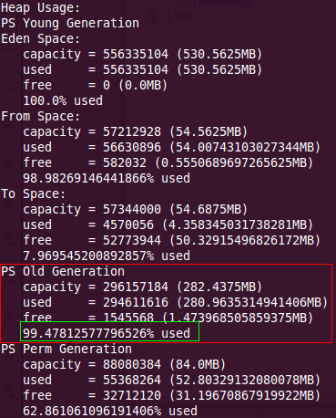
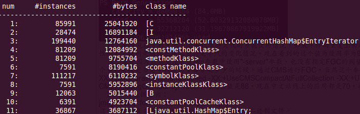
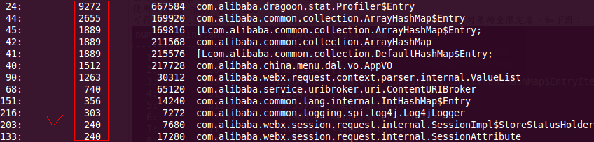
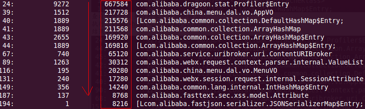

# JVM的性能调优

摘自：性能问题的查找 <https://blog.csdn.net/fenglibing/article/details/7191302>  

## 发现问题

1. 使用w命令查看CPU的Load情况，Load越高说明问题越严重；  
2. 使用jstat查看FGC发生的频率及FGC所花费的时间，FGC发生的频率越快、花费的时间越高，问题越严重；  

## 导出数据

在应用快要发生FGC的时候把堆导出来。  

1. 查看快要发生FGC使用命令：jmap -heap <java_pid>  

   会看到如下图结果：  
     

   以上截图包括了新生代、老年代及持久代的当前使用情况，如果不停的重复上面的命令，会看到这些数字的变化，变化越大说明系统存在问题的可能性越大，特别是被红色圈起来的老年代的变化情况。当看到老年代使用率为99%或快接近的时候，就立即可以执行导出堆栈的操作了。  

   注：这是因为我这里没有在jvm参数中使用"-server"参数，也没有指定FGC的阀值，在线上的应用中通过会指定CMSInitiatingOccupancyFraction这个参数来指定当老年代使用了百分之多少的时候，通过CMS进行FGC，当然这个参数需要和这些参数一起使用“-XX:+UseConcMarkSweepGC -XX:+CMSParallelRemarkEnabled -XX:+UseCMSCompactAtFullCollection -XX:+UseCMSInitiatingOccupancyOnly”，CMSInitiatingOccupancyFraction的默认值是68，现在中文站线上的应用都是70，也就是说当老年代使用率真达到或者超过70%时，就会进行FGC。  

2. 将数据导出：jmap -dump:live,format=b,file=/some/path/heap_dump.hprof <java_pid>  
   这个时候生成heap_dump.hprof这个二进制文件。  

## 通过命令查看大对象

1. 查看所有对象，可得到如下包含对象序号、某个对象示例数、当前对象所占内存的大小、当前对象的全限定名。  
   执行：jmap -histo <java_pid> | less  
   结果如图：  
     

2. 查看数量最多的对象，并按降序排序输出。  
   执行：jmap -histo <java_pid> | grep alibaba | sort -k 2 -g -r | less  
   结果如图：  
     

3. 查看占用内存最多的对象，并按降序排序输出。(其实jmap默认是按内存排序的，后面的sort可以删掉)  
   执行：jmap -histo <java_pid> | grep alibaba | sort -k 3 -g -r | less  
   结果如图：  
     
